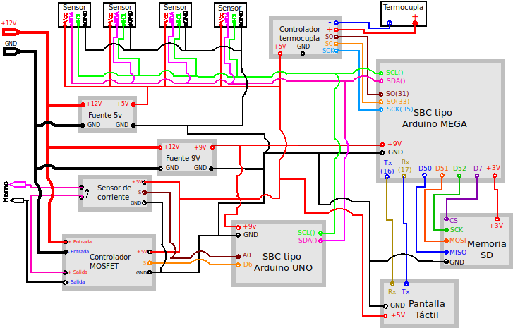
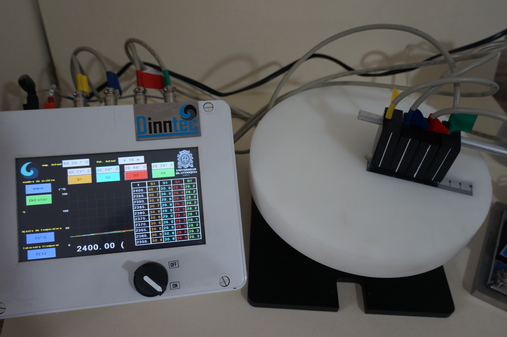

## Overview
Welcome to the Heat Transfer Study Equipment Series! This series of equipment is designed for studying heat transfer in various systems. Each equipment enables the exploration of different aspects of heat transfer, including linear and radial heat transfer in metals, radiation heat transfer, and heat transfer in extended surfaces.

## Features
- Comprehensive Heat Transfer Studies: Explore heat transfer phenomena in metals, radiation, and extended surfaces.
- Computerized Data Collection: Equipped with computerized systems that collect data from temperature sensors and regulate furnace temperatures to maintain set temperatures.
- Customizable Experiment Parameters: The software allows for the adjustment of experiment parameters and visualization of sensor readings.
- USB Connectivity: Communicate with a PC via USB for data storage and analysis.
- Compact Design: Compact construction makes the equipment easy to locate and use in limited spaces.
Equipment Included
Linear Heat Transfer Equipment: Study heat transfer in metals using linear configurations.
Radial Heat Transfer Equipment: Investigate radial heat transfer phenomena in metals.
Radiation Heat Transfer Equipment: Explore heat transfer through radiation.
Extended Surface Heat Transfer Equipment: Examine heat transfer in extended surfaces and fins.

## Technologies Used
The devices were developed using a combination of software and hardware technologies, including:

- Python: Python programming language was utilized for developing the software interface for controlling the equipment, adjusting parameters, and collecting data.
- Arduino: Arduino microcontrollers were employed to interface with sensors, regulate furnace temperatures, and control various components of the equipment.
- EagleCad: EagleCad was used for designing the electronic circuits and schematics for the equipment, ensuring optimal functionality and performance.
- Electronic Devices: Various electronic components and devices were integrated into the equipment to facilitate data collection, temperature regulation, and communication with external systems.

### About Dinntec
This project is developed and distributed by Dinntec, a company based in Colombia specializing in the implementetation of innovative technology solutions. Dinntec is committed to providing high-quality educational resources to enhance learning experiences in various fields, including physics and thermodynamics.

### Images
&nbsp;
&nbsp;
&nbsp;
